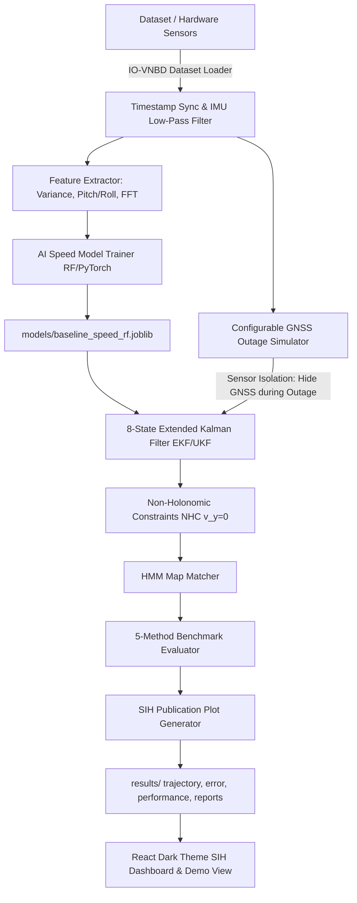

# System & Architecture Specification — IDR NAV (SIH Edition)

## 1. System Architecture & SIH Evaluation Pipeline

---

## 2. Mathematical State & Sensor Fusion Specifications

### 8-State Vector Matrix
$$x_k = \begin{bmatrix} p_N & p_E & v_N & v_E & \psi & b_{ax} & b_{ay} & b_{gz} \end{bmatrix}^T$$

- **Position ($p_N, p_E$)**: Local North-East meters relative to reference origin.
- **Velocity ($v_N, v_E$)**: North and East velocity components in m/s.
- **Heading ($\psi$)**: Yaw orientation angle in radians.
- **IMU Biases ($b_{ax}, b_{ay}, b_{gz}$)**: Accelerometer zero-g offsets and gyroscope drift bias.

### Measurement Matrix $H_k$ (GNSS Fix Available)
$$H_k = \begin{bmatrix} 1 & 0 & 0 & 0 & 0 & 0 & 0 & 0 \\ 0 & 1 & 0 & 0 & 0 & 0 & 0 & 0 \\ 0 & 0 & 1 & 0 & 0 & 0 & 0 & 0 \\ 0 & 0 & 0 & 1 & 0 & 0 & 0 & 0 \end{bmatrix}$$

### Non-Holonomic Constraints (NHC)
Enforces lateral velocity $v_{lateral} = -v_N \sin(\psi) + v_E \cos(\psi) \approx 0$ and vertical velocity $v_{vertical} \approx 0$.

---

## 3. SIH Directory Output Pipeline
- `results/trajectory/`: Contains Ground Truth vs GNSS, Raw DR, AI DR, AI+EKF, and Map Matched trajectory overlay PNG plots.
- `results/error/`: Position error curves over time.
- `results/performance/`: 5-method Position RMSE bar chart.
- `results/reports/`: `sih_evaluation_summary.json` and `sih_evaluation_summary.csv`.
