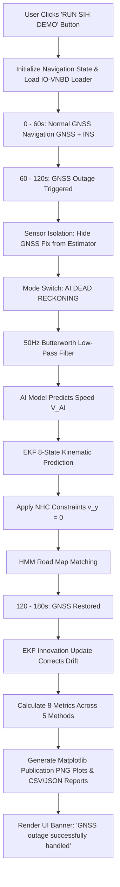

# User & Navigation Flow Diagrams — IDR NAV (SIH Edition)

## 1. One-Click "RUN SIH DEMO" Sequence Flow

```mermaid
flowchart TD
    UserClick[User Clicks 'RUN SIH DEMO' Button] --> InitState[Initialize Navigation State & Load IO-VNBD Loader]
    InitState --> Phase1[0 - 60s: Normal GNSS Navigation GNSS + INS]
    Phase1 --> Phase2[60 - 120s: GNSS Outage Triggered]
    
    Phase2 --> IsolateGNSS[Sensor Isolation: Hide GNSS Fix from Estimator]
    IsolateGNSS --> AutoAIDR[Mode Switch: AI DEAD RECKONING]
    AutoAIDR --> IMUFilter[50Hz Butterworth Low-Pass Filter]
    IMUFilter --> AISpeed[AI Model Predicts Speed V_AI]
    AISpeed --> EKF[EKF 8-State Kinematic Prediction]
    EKF --> ApplyNHC[Apply NHC Constraints v_y = 0]
    ApplyNHC --> MapMatch[HMM Road Map Matching]
    
    MapMatch --> Phase3[120 - 180s: GNSS Restored]
    Phase3 --> FusionCorrect[EKF Innovation Update Corrects Drift]
    
    FusionCorrect --> ComputeMetrics[Calculate 8 Metrics Across 5 Methods]
    ComputeMetrics --> PlotGen[Generate Matplotlib Publication PNG Plots & CSV/JSON Reports]
    PlotGen --> RenderBanner[Render UI Banner: 'GNSS outage successfully handled']
```
